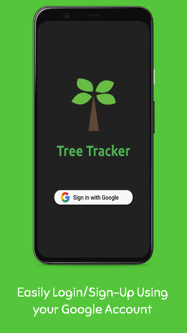
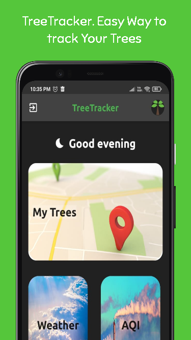
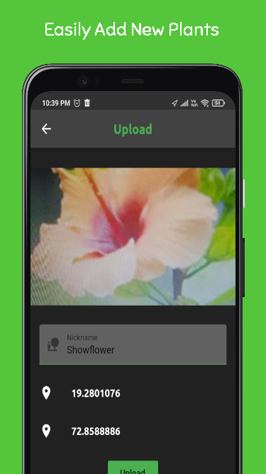
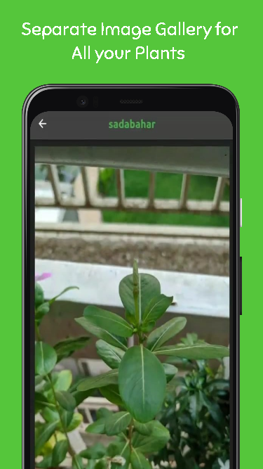
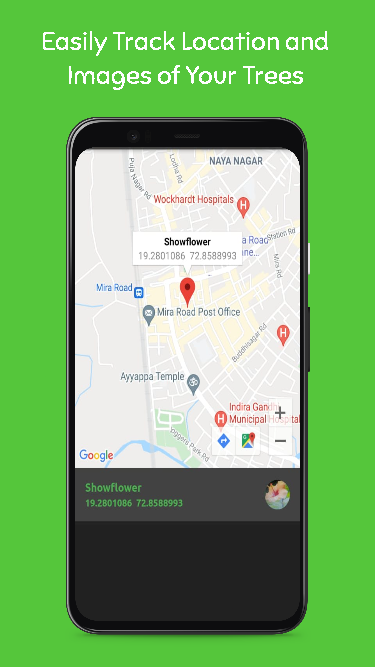
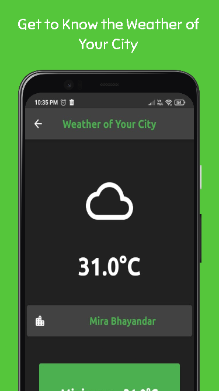
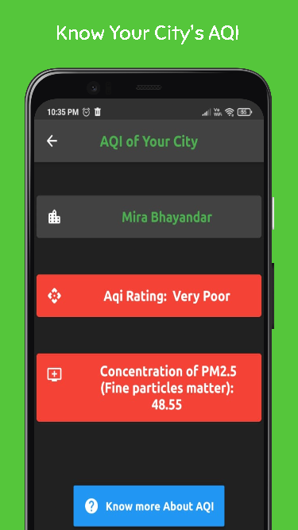
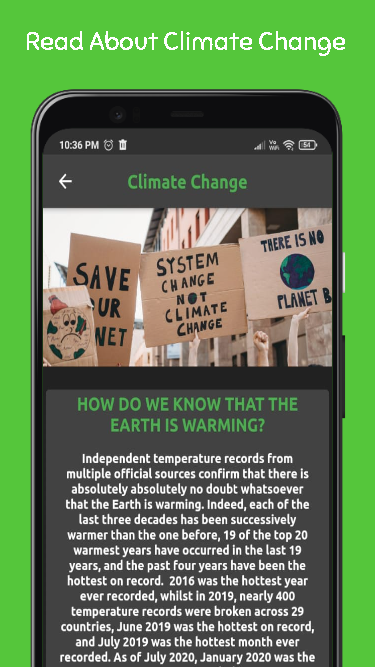

# TreeTracker

As deforestation has ramped up, Earth’s climate has changed significantly. Warmer, more adverse climate conditions are creating more difficult growing conditions for forest ecosystems. 
  

<h2>App Download </h2>

App coming soon on Google Play Store

<h2>The Problem</h2>

In the modern era, we lack a connection with trees and nature in general.
One billion hectares of trees cut down in just 40 years, that's the entire size of Europe.
Following the current upwards trend of deforestation, half of all forests will be gone by 2100.
Trees play the most crucial role of carbon sequestration besides oceans.
The goal of this project is to form a connection with trees making us liable for their growth and hence have a personalized hand in reducing climate change.

<h2>Our Solution</h2>

This is an app-based project. Which will be able to capture images of trees using the phone’s camera. After capturing the image, the user will be able to give that tree a pet or nickname and then the app will store that in Firebase. Along with that, it will also store the location or the PlusCode of the area where the image has been captured. Every month user has to update the picture of the tree. This way the user will be given updates about the trees and the importance of forests, updates on climate change, etc. 

<h2>Purpose</h2>

The main purpose of this app is to make humans(users) more aware about the modern-day problems like climate change, deforestation etc. and bring them one step closer to nature.

<h2> Screenshots </h2>

